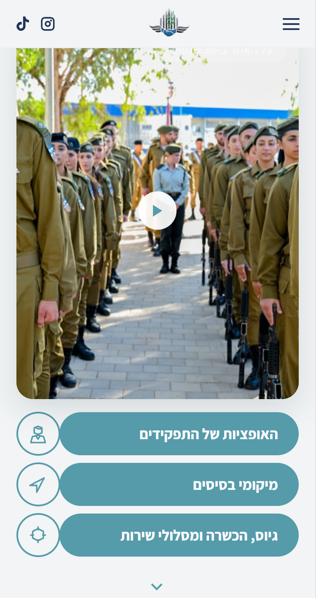
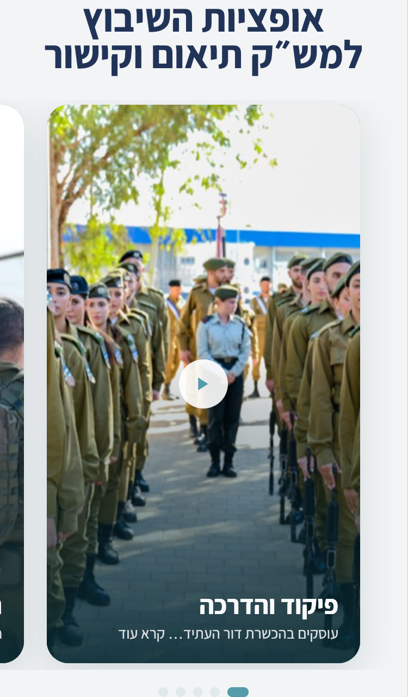
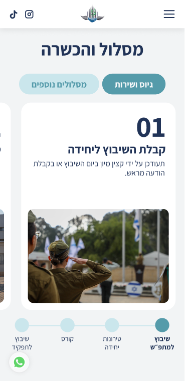
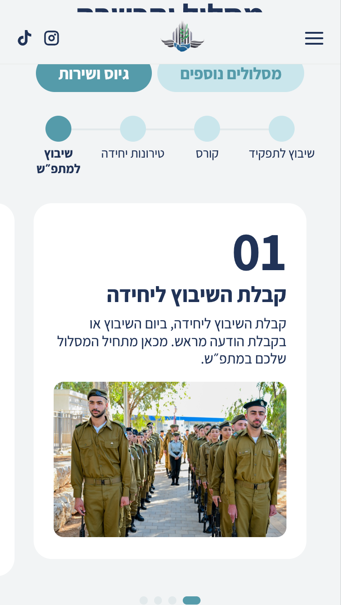
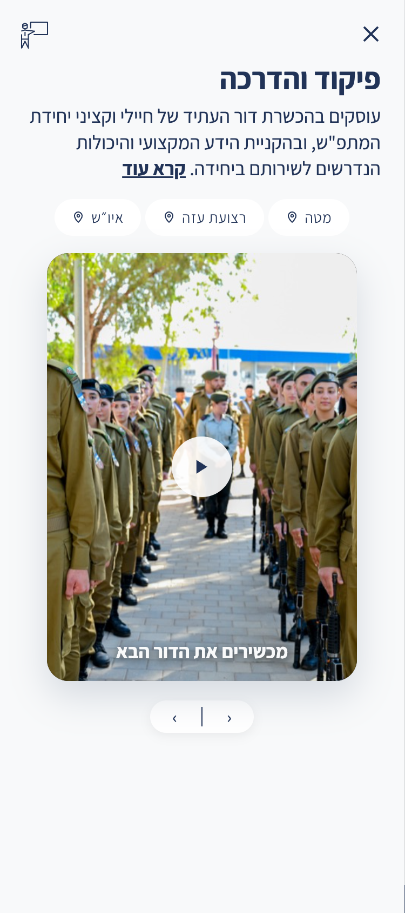

# דיוקי עיצוב — קונספטים 1 ו-2 מול הפיגמה

בדיקת QA להשוואה בין הפרוטוטייפים (HTML) לבין העיצוב בפיגמה.
נבדק ברוחב מובייל (375px), סקשן-אחרי-סקשן, מול הפריימים בפיגמה.

**קובץ פיגמה:** Matpash – Main
**מה לא נכלל בבדיקה:** כל מה שקשור למפות ולמסכי הבסיסים (המפה, הסיכות, מסך פרטי הבסיס) — לפי בקשת הלקוחה, זה כבר תוקן בנפרד והפיגמה לא מייצג את הרצוי.

לכל תיקון רשום: **מה בפיגמה / מה בקוד כרגע / מה לתקן** — כדי שיהיה חד-משמעי.

---

## קונספט 1 — גלילה ליניארית

### 1. תפריט הווידאו — האייקונים העגולים הפוכים (ימין↔שמאל)
**סקשן:** התפריט מתחת לכרטיס הווידאו ("האופציות של התפקידים" / "מיקומי בסיסים" / "גיוס, הכשרה ומסלולי שירות").
`Figma node: 1519-7612`

| פיגמה (נכון) | הקוד כרגע (לתיקון) |
|---|---|
|  |  |

- **בפיגמה:** בכל שורה, העיגול עם האייקון נמצא ב**צד ימין** של השורה, והבָּר הצבעוני עם הטקסט משמאלו. הטקסט בתוך הבָּר **ממורכז**.
- **בקוד כרגע:** העיגול עם האייקון עבר ל**צד שמאל**, הבָּר מימין. הטקסט בתוך הבָּר **מיושר לימין**.
- **לתקן:** להפוך את סדר האלמנטים בכל שורה — האייקון העגול לצד ימין, הבָּר משמאלו. וליישר את הטקסט בבָּר ל**מרכז**.

### 2. קרוסלת התפקידים — חסרים תפקידים (מספר העיגולים)
**סקשן:** "אופציות השיבוץ למש״ק תיאום וקישור".
`Figma node: 1519-7672`

| פיגמה — 8 עיגולים | הקוד כרגע — 5 עיגולים |
|---|---|
|  |  |

- **בפיגמה:** הקרוסלה כוללת **8 תפקידים** (8 עיגולי ניווט מתחת).
- **בקוד כרגע:** רק **5 תפקידים** (5 עיגולים): פיקוד והדרכה, תיאום אזרחי, מבצעים, תיאום ביטחוני, דוברות והסברה.
- **לתקן:** להשלים ל-8 תפקידים כמו בקונספט 2. חסרים: **מידע ומחקר, קשרי חוץ, תשתיות**.
- *הערה:* מיקום העיגול הפעיל תקין (הנקודה המוארכת בצד ימין = הכרטיס הראשון). רק הכמות חסרה.

### 3. טיימליין ("מסלול והכשרה") — מיקום ה-stepper + שורת נקודות מיותרת
**סקשן:** הטיימליין בתחתית העמוד.
`Figma node: 1733-12301`

| פיגמה — stepper מתחת | הקוד כרגע — stepper מעל + נקודות מתחת |
|---|---|
|  |  |

- **בפיגמה:** סרגל השלבים (stepper — שיבוץ למתפ״ש / טירונות / קורס / שיבוץ לתפקיד) נמצא **מתחת** לכרטיס. **אין** שורת נקודות (dots) נפרדת.
- **בקוד כרגע:** ה-stepper נמצא **מעל** הכרטיס, ובנוסף נוספה **שורת נקודות (dots) מתחת** לכרטיס — כפילות שאין בפיגמה.
- **לתקן:** להעביר את ה-stepper ל**מתחת** לכרטיס (הוא המנווט של הטיימליין), ולהסיר את שורת הנקודות הנוספת.
- *תקין:* סדר כפתורי המעבר (גיוס ושירות פעיל מימין / מסלולים נוספים משמאל) וסדר שלבי ה-stepper (שיבוץ למתפ״ש פעיל מימין) — תואמים לפיגמה.

---

## קונספט 2 — טאבים

### 4. כרטיס פרטי התפקיד — כפתור הסגירה (✕) והאייקון הפוכים (ימין↔שמאל)
**סקשן:** ה-overlay שנפתח בלחיצה על כרטיס תפקיד (למשל "תיאום אזרחי" / "פיקוד והדרכה").
`Figma node: 1671-11825`

| פיגמה — ✕ שמאל / אייקון ימין | הקוד כרגע — ✕ ימין / אייקון שמאל |
|---|---|
|  |  |

- **בפיגמה:** כפתור הסגירה **✕** נמצא למעלה ב**צד שמאל**, ואייקון התפקיד נמצא למעלה ב**צד ימין**.
- **בקוד כרגע:** הפוך — ה-**✕** בצד ימין ואייקון התפקיד בצד שמאל.
- **לתקן:** להחליף צדדים — **✕** בצד שמאל למעלה, אייקון התפקיד בצד ימין למעלה.
- *הערה משנית:* בפיגמה האייקון הוא סמל של דגל/מצגת; בקוד הוא סמל של פנקס/עיפרון. כדאי להתאים את האייקון (או לוודא שלכל תפקיד יש האייקון הנכון).

---

## מה נבדק ונמצא תקין (אין צורך לגעת)

- **קונספט 1:** מסך הירו (כותרת, תת-כותרת, כפתור "גללו מטה"), הכותרת "אופציות השיבוץ", מיקום העיגול הפעיל בקרוסלה, כפתורי המעבר וה-stepper בטיימליין (הסדר תקין).
- **קונספט 2:** מסך הירו (כולל ה-chip "מתאם פעולות הממשלה בשטחים"), **סדר הטאבים** (תפקידים פעיל מימין → בסיסים → השירות משמאל) — תקין, אקורדיון "השירות" (כפתורי המעבר בצד הנכון, קו ההתקדמות והנקודות בצד ימין) — תקין.

## דגשים אופציונליים (Nice to have)

- **קונספט 2, אקורדיון השירות:** הכותרות בקוד ארוכות מעט מהפיגמה ("שיבוץ למתפ״ש" מול "שיבוץ", "קורס תיאום וקישור" מול "קורס"). לא באג — רק לוודא שזה הניסוח הרצוי.
